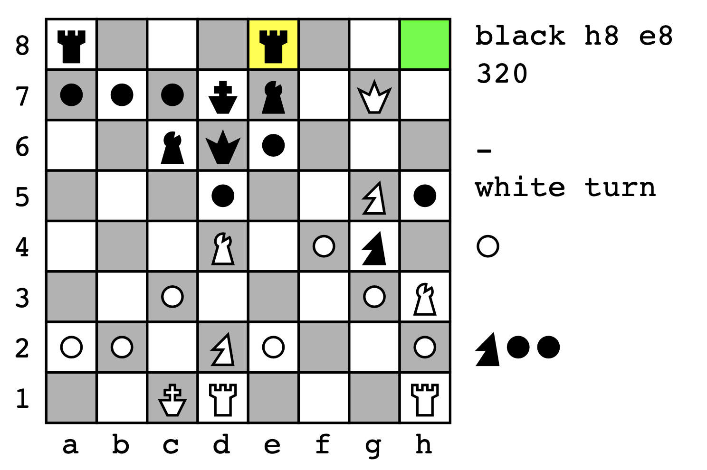

# PSChess
A Chess Engine in PostScript

## PSChess – A Chess Engine in PostScript

See also these two articles on seriot.ch:

- article about the [making and inner working of PSChess](https://seriot.ch/projects/pschess.html)
- remarks about [programming in PostScript](https://seriot.ch/projects/programming_in_postscript.html)

#### Motivation

- To what extend can we execute arbitrary code on a printer?
- How to implement a chess engine in PostScript?
- Can you play chess against your printer?

#### Usage

You can use PSChess in GhostScript with the following arguments:

    $ gs -DNOSAFER -dBATCH -dNOPAUSE -sDEVICE=pdfwrite -sOutputFile="%d.pdf" main.ps

The user plays by entering moves like `d2d4`.
    
The output is produced on both the console and PDF documents.

Console output:
    
    r...r...        black h8 e8
    pppkb.Q.        320
    ..bqp...
    ...p..Np        P...............
    ...B.Pn.        npp.............
    ..P...PB
    PP.NP..P        -
    ..KR...R        white turn                   

PDF output:

</src>

You can also play directly in GhostView with:

1. in `main.ps`, set `USE_GHOSTVIEW` to `true`
2. `gv -scale=2 -` (mind the trailing dash)
3. in GhostScript console, type `(main.ps) run`

#### Limitations

- human plays white, computer plays black
- pawns convert into queens only
